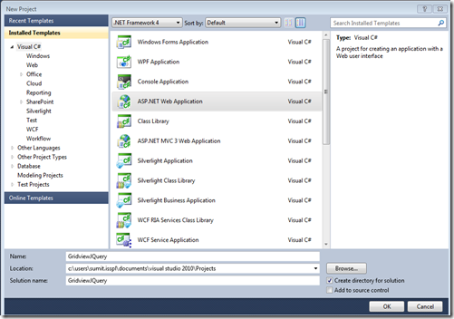
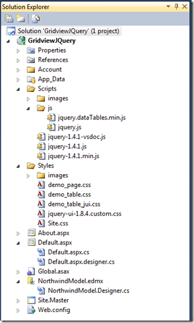
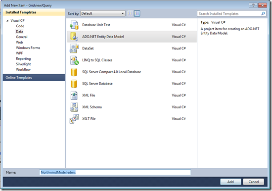
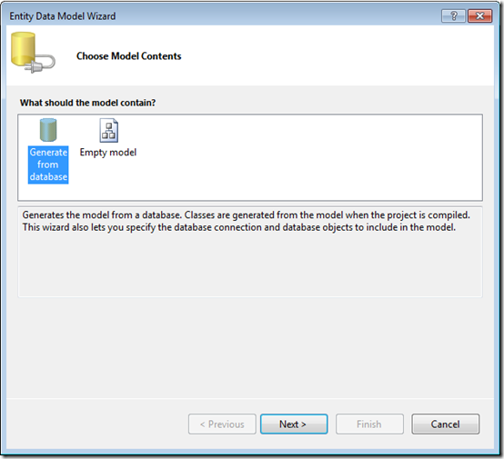
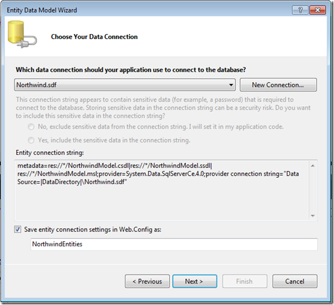
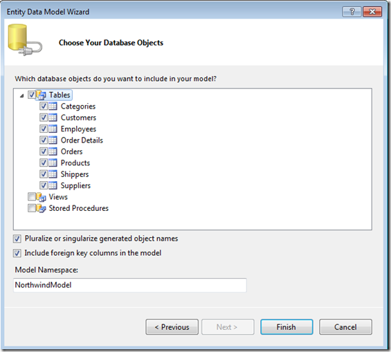
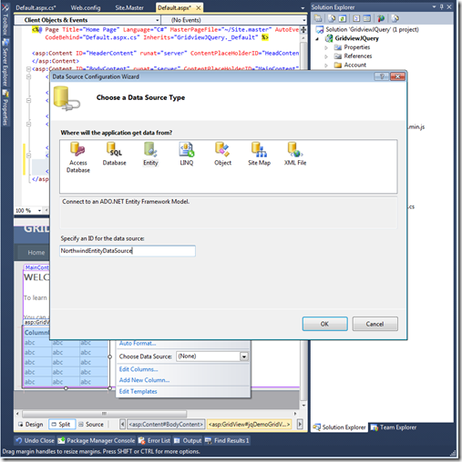
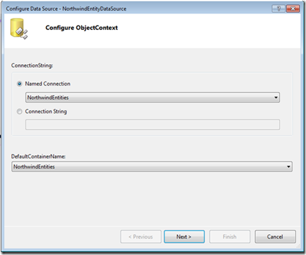
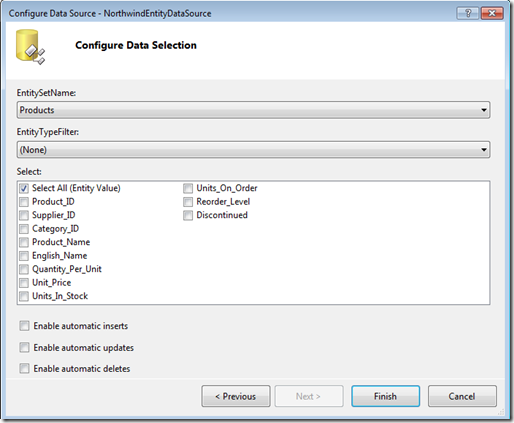

I know I know, ASP.NET WebForms is a passe and MVC is the king of the ring, but if you, like me, still have to work with legacy WebForm components then more often than not you'll need to use the GridView control. When using GridView control if you want to use jQuery and jQuery plugins to jazz up your grid, you'll hit a wall because the GridView control emit straight <td> <tr> instead of the more 'compliant' <thead> <tr> <th> and <tbody> <tr> <td>

As a result most jQuery plugin's don't work. I was despairing at this thought when I came across [this](http://www.dotnetcurry.com/ShowArticle.aspx?ID=250) article on [www.dotnetcurry.com](http://www.dotnetcurry.com)

The article demonstrates tips and tricks with GridView, but it had the hidden gem of how to get the GridView to render <thead> tags. Recipe is simple, handle the GridView's PreRender event and put the following code in

\[code\] if (myGridView.Rows.Count > 0) { myGridView.UseAccessibleHeader = true; myGridView.HeaderRow.TableSection = TableRowSection.TableHeader; } \[/code\]

With this done, the whole wide world of jQuery goodness opens up. In the following example I use the DataTables plug-in to add a nifty search functionality and frozen header and vertical scrolling.

## Example

We will create a new ASP.NET web application and use the DataTables jQuery plugin to jazz up our grid view control.

### Step 1 – Getting Started

Fire up Visual Studio (whichever version you have) and create a new ASP.NET Web Application

### Step 2 – Finding a Data Source (ignore this and Step 3 if you already have a data source handy)

In Solution Explorer, right click on App\_Data folder and select Add Existing Item. I have SQL Server compact edition installed which installs the NorthwindDB.sdf file in the following folder location

C:\\Program Files (x86)\\Microsoft SQL Server Compact Edition\\v4.0\\Samples\\Northwind.sdf

If you don’t have Compact Edition 4.0 you can download it from [here](http://www.microsoft.com/downloads/en/details.aspx?FamilyID=033cfb76-5382-44fb-bc7e-b3c8174832e2)

### Step 3 – Connecting to Northwind database

Bring up Server Explorer and double click on Northwind.sdf to connect to it. Change the header to something like “Products From Northwind Database” and remove the other default paragraphs.

### Step 4 – Add the GridView

Double click on Default.aspx to open the designer. Switch to Split or Design mode and Drag and Drop the GridView control

### Step 5 – Do the magic to render proper table tags

Change the Name of the gridview to jqDemoGridView. Add a PreRender event handler and place the above code in the event handler to ensure the GridView emits proper table tags in HTML.

### Step 6 – Get the scripts

a. If you are using derivatives of Visual Studio 2010 your project should come with jQuery included by default under the Scripts folder. I got version 1.4.1 with my project. You can get the latest version from [here](http://jquery.com/) and place it in your Scripts folder.

b. Next we will get the DataTables plugin scripts from [here](http://datatables.net/download/) (~8Mb). Download the zip file and extract it. Open Windows Explorer and navigate to the extracted folder. There should be three folders from the zip, examples, extras and media.

c. From the media folder select the images and js folder and press Ctrl+C to copy them Go to Visual Studio, select the Scripts folder in Solution Explorer and press Ctrl+V to add the folders.

d. From the media\\css folder select all the css files and paste it in Solution View’s Styles folder.

e. From the examples\\example\_support\\themes\\smoothness folder copy the jquery-ui-1.8.4.custom.css and the images folder. Paste is under Sytles folder

f. Exclude the jquery.dataTables.js, jquery.js and jquery.dataTables.min.js.gz files. The rest of the files are enough. (the .min.js version is minified meaning it doesn’t have any kind of whitespaces and reduced in size as much as possible. It’s not at all readable so if you want to go through the js to understand it, use the non-minified version) Your solution explorer should looks something like the following.

### Step 7 – Connect to Data Source

I will connect to the above data using the Entity Data Source. You can select your own data connection mechanism. Basically the idea is to get the GridView populated with enough data that requires a vertical scrollbar. If you are using SQL CE 4.0 like me follow along.

a. Right Click on Solution Explorer and Select Add New Item. Select Data from the Installed Templates and ADO.Net Entity Data Model. Name it NorthwindModel.edmx

b. Select the default ‘Generate from Database’ and click Next.

c. If Northwind.sdf connection was open it will select it by default and the next screen should look something like the following.

d. The Wizard will connect to the DB and load up the schema. Select all the tables and click Finish.

e. Save solution and do a ‘Build All’.

### Step 7 – Tie the GridView to the data source

a. In the designer click on the GridView smart tag and bring up the Choose Data Source Dialog

b. Click Ok to bring up the Configure ObjectContext wizard. It should select the NorthwindEntites connection it created while building the data source by default. If you named it differently in Step 6.c. select the name that you gave it. The DefaultContainerName will come up automatically once you select the Named Connection. Click Next.

c. Select the EntitySetName (table) that you want to show. I’ve selected the Products table and opted to show all the columns. You can pick and choose. As of now we are not doing any Inserts/Updates or Deletes, keep them unchecked. Click Finish

If you run your application at this point you will see the grid populated with data from the products table. Just for kicks right click on the browser to bring up source, you will see the <thread><tr><th> rendering for the table in the final HTML. So far so good.

### Step 8 – Bring in the jQuery Goodies

Here comes the fun part now. Let’s tie up our grid with jQuery and datatables goodness.

a. Open Site.Master and drag and drop the demo\_table\_jui.css from the Scripts\\css folder on to the header area

b. Open the Default.aspx and in the BodyContent area, drop the jQuery script file and the jquery.dataTables.min.js file.

\[code\]   \[/code\]

c. Add the following script to apply the plugin to the GridView

\[code\]  \[/code\]

The dataTable method is taking an object as a parameter. The object is defined in JSON. Let’s look at each parameter and try to get what it is i. bJqueryUI : A boolean parameter indicating if JqueryUI should be used to beautify the grid. We set it to true ii. bPaginate: A boolean parameter indicating if pagination should be enabled. We set it to false to force vertical scrollbars iii. bLengthChange: A boolean parameter (not sure what it does, it’s set to false in our code). iv. bFilter: A boolean parameter indicating if Filtering should be enabled. We set it to true. v. bSort: A boolean parameter indicating if Sorting should be enabled. We set it to true. vi. bAutoWidth: A boolean parameter indicating if datatables should try to set the width of the columns. We set it to false vii. sScrollY: A integer parameter indicating the fixed height of the table. Scrolling is enabled after rows of data exceed this height. viii. sScrollX and sScrollXInner: Parameters that help enable horizontal scrolling.

For a complete reference to possible parameters refer to DataTables’ excellent documentation on their site. A quick reference guide is available [here](http://www.datatables.net/ref/) Clean up the Default.aspx by removing the default messages and run the application.

Lo and behold!

### Step 9 – Playing around with the ‘jQuerified Grid’

a. Type in Anton in the search text box and see the grid filter data down to 2 rows of data showing Chef Anton

b. Click on any of the headers and watch the grid get sorted without any postback (entirely on the client side)

c. Scroll horizontally and vertically and see how the headers remain aligned.

## In Conclusion

We started off with the small goal of figuring out how to emit thead for a GridView control and ended up applying a jQuery plugin to add rich client side functionality thanks to the proper rendering of thead and tbody tags. This opens up a vast playground for jQuery enabled ASP.NET sites with interactive GridView. Notice we haven’t used Microsoft’s Ajax Control Tool Kit anywhere. Though I have used DataTables and jquery and Ajax Control Toolkit all in the same page and they do work together. But that’s another story. I am trying to make a clean break from ACT and do things in jQuery only. Hopefully sometime soon, I’ll be able to demonstrate use of more jQuery plugins with more functionality like Edit/Update/Delete from the grid view control.

The entire source code including the Northwind.sdf file is uploaded [here](http://sdrv.ms/122MXzH "GridViewJqueryCode.zip") (hosted on SkyDrive – 714KB download size).

This code uses DataTables.net which is released under GPL v2. Please respect open source licensing model. Whatever little I have written is made available As Is.

Have fun coding!
