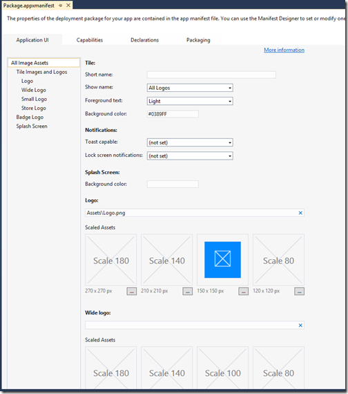
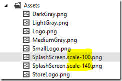

I just spent a few lazy minutes looking up what it takes to name assets (images) for appropriate scaling, and since I didn’t find the correct keyword to look it up in one go, writing this down to bookmark it for myself.

It’s a good idea to provide an independent images for your Windows 8 Store App, each for the appropriate scale factor. Well you don’t have to and if you only provide the Scale 100 images Windows will upscale it for you, but it won’t be pretty. With the Surface 2 going Full HD you have all the more reason to provide all the necessary scale factor images so your app looks the sharpest everywhere.

Now the endeavor is not for the faint hearted, you will end up requiring about 25 different images. However there is an easy way to name them such that they get picked up automatically for each scale and you don’t have to go assigning them independently.

For example if you are setting up assets for Splash screen you can name them as follows:

And once you assign the scale-100 image, the rest will get picked up automatically.

Mind you if you have just one image, you can name it anything and assign it to the mandatory Scale 100 resource. However if you put in a scale-xxx image, you have to rename your Scale 100 resource to say scale-100 explicitly.

Well, that was a small naming convention thingy that I knew existed but forgot what it was exactly. Now I’ve got it written down, shouldn’t forget it ever now .
