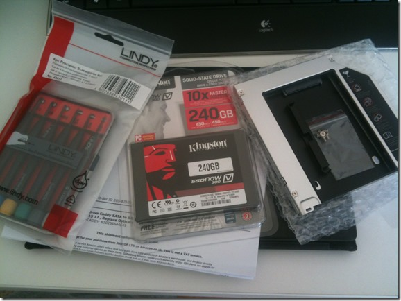
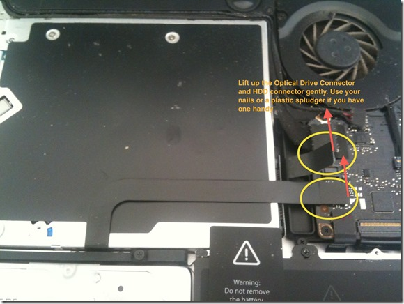
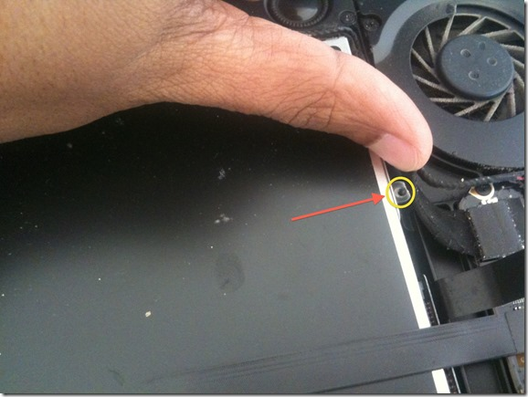
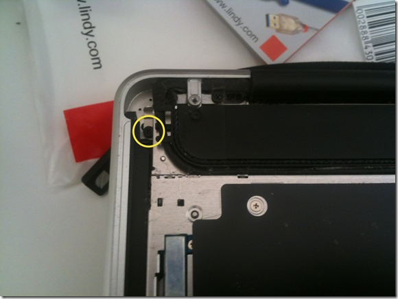
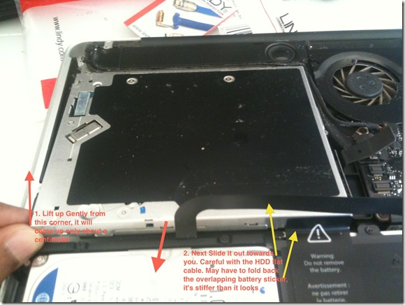
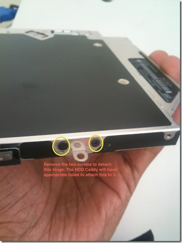

It’s fair to say, my MBP is dated and well past it’s prime. It’s a Mid 2009 13” Core 2 Duo that I purchased new in Jan 2010. It was my very first personal laptop and has worked flawlessly for the last 3 years. I’ve taken good care and given it three updates (before this week), Memory Upgrade from 4 Gig to 8 Gig, HDD Upgrade from the default 270 (or so) Gig to a 1 TB Western Digital Caviar Blue. The third upgrade was from OSX Snow Leopard to OSX Lion.

This week I gave it another upgrade, added an SSD in the CD Drive slot. The components involved were

- [Kingston Technology 240GB Solid State Drive 2.5-inch V300 SATA 3 with Adapter](http://www.amazon.co.uk/gp/product/B00A1ZTZNM/ "Kingston Technology 240GB Solid State Drive 2.5-inch V300 SATA 3 with Adapter")
- [JUSTOP Omnibay 2nd Hard Disk Drive Caddy SATA to SATA for Unibody Apple Macbook, Macbook Pro 13 15 17 , Replace Optical Drive](http://www.amazon.co.uk/gp/product/B008F89KKA/ref=oh_details_o00_s00_i02?ie=UTF8&psc=1)
- [LINDY Computer Technician Precision Screwdriver Set](http://www.amazon.co.uk/gp/product/B0000934GN/ref=oh_details_o00_s00_i01?ie=UTF8&psc=1) (Left my toolkit in India so it’s start from scratch here )

I had initially zeroed in on the Samsung EVO 250 Gigs drive, but ultimately settled for the Kingston which I’ve (a good) experience with.

# Swapping the Parts

**Step 1**: Flip your MacBook Pro and unscrew the 10 or so screws. Start from the top right corner and go anti-clockwise, the first three screws will be the longer than the rest.

**Step 2**: Before we remove the Optical drive we have to unhook two flat cables. First one connects the optical drive to the MoBo and the second one connects the HDD to the MoBo. Use a plastic spludger or your nails to gently lift them up as shown below.

**Step 3**: There are three screws that hold it in place, and there is a connector cable to the motherboard that we have to remove. The first screw is under the cable towards the center of the system. You have to push the cable up, to reveal the screw.

**Step 4**: The next screw is on the Top Left corner of the system and easily accessible

**Step 5**: The Final screw is near the middle on the Left hand edge, again easily accessible

**Step 6**: Next lift up the Optical drive from the bottom left corner gently. It will come up only about a centimeter then pull it towards yourself. If you encounter resistance bend the battery sticker and the straighten the HDD flat cable, they are stiffer than they look.

**Step 7**: Once you have extracted the Optical Drive there is a hook attachment that you need to unscrew and screw it back to the HDD caddy.

**Step 8**: The flat cable that we removed from the Motherboard earlier goes into the Optical drive via another adapter. Gently pull it out as well, after you have put in your new HDD into the HDD caddy, you can put this adapter back into the HDD Caddy.

Step 9: Once you have snapped the HDD into the caddy, flip the caddy over and put in two screws (the Caddy came with a bunch of screws, pick the right size)

**Step 10:** Here on it’s the inverse process of Step 6 and go back carefully, till your MacBook is bolted up.

# Notes and Caveats

You are probably wondering why I put the new SSD into the HDD caddy instead of the Hard Drive bay because OSX can’t boot off a drive in the Optical Drive bay.

Well, I use Windows 8.1 via VMWare Fusion more often than I use the native OSX, and running the VMs off the same drive as the OS was really stretching it. OSX would literally be rendered useless when the VMs was running. I moved the VM to an external USB drive, that improved things but had it’s own set of issues with the VMs crashing after going into Sleep mode and so on.

I want the SSD to be where my VMs are run off. After the installation, OSX is slightly more useful with the Win8.1 VM running and the Win8.1 VM simply screams. It is almost as fast as Windows on SSD natively. I moved the VMWareFusion.app to the SSD as well.

## Enabling TRIM

Sometimes we just hate OSX for being a ‘\*\*\*\*\*’. The case here being TRIM support for Apple installed SSDs only. YES! OSX Lion supports TRIM but only for Apple installed SSDs not third party SSDs. After you have ‘Initialized’ your drive using Disk Utility tool, get yourself [Chameleon SSD Optimizer](http://chameleon.alessandroboschini.it/features.php) or some other similar third party product and enable TRIM on your SSD without fail. YMMV so use it at your own risk. The Disk Utility Tool will pop up and ask you to Initialize the disk first time you boot up and it detects the SSD.

# Conclusion

Things are going well so far. Near native Windows performance and OSX can be used in parallel. Most people do the opposite by putting the OS on the SSD and moving everything else off it. In my case I don’t need OSX to run any faster than it is at the moment. I needed a stable and better performing Windows VM. I got that. This is a strictly temporary situation until I get my Haswell computer together and the SSD might be repurposed there, but that story is for later.

P.S. Amazon decided that I could wait for the Optical Drive enclosure so it has scheduled it for delivery in December . Till then the Optical Drive is wrapped away in bubble wrap. Once the drive enclosure arrives I’ll be able to use the Optical Drive as an external USB drive.
